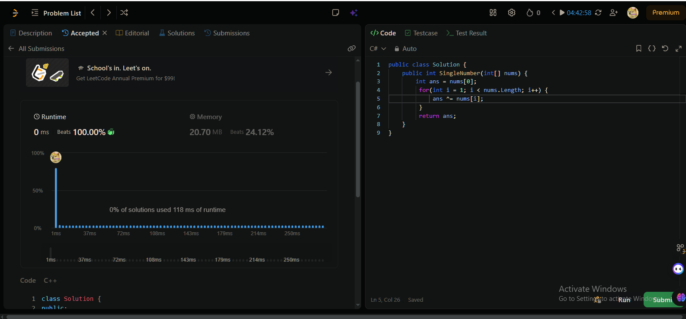

# LeetCode Profile
https://leetcode.com/u/Asemo505/

# used XOR 
  - Because if a number is repeated an even number of times, its bitwise XOR equals zero, and the final XOR result will be the number with the odd frequency.